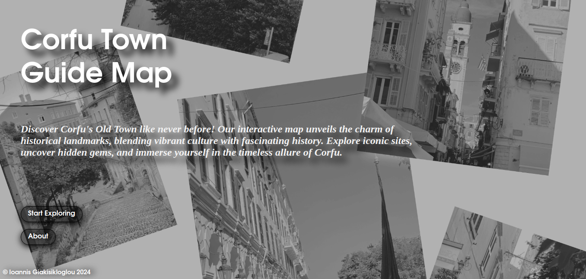
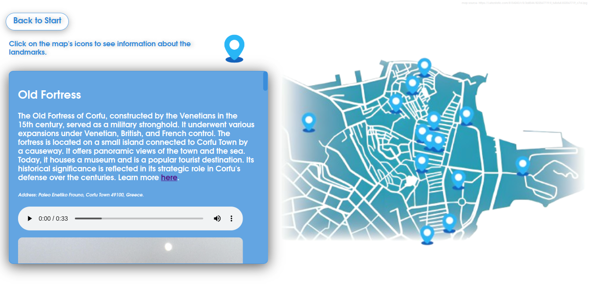
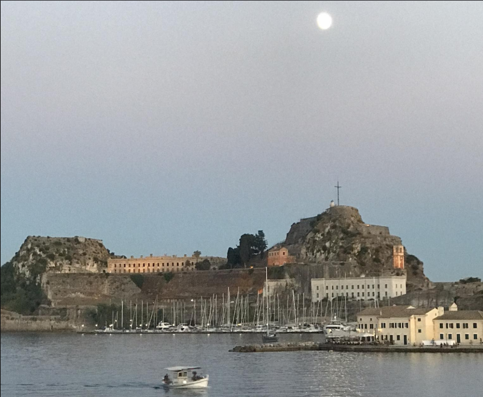
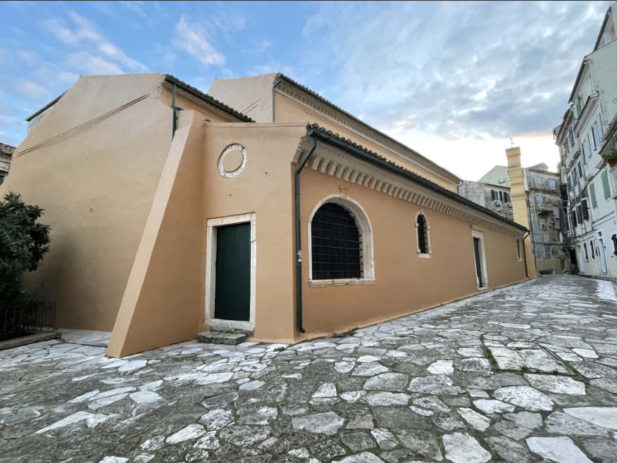

# Τι είναι το Corfu Town Guide Map;

Ένας διαδραστικός χάρτης της Παλαιάς
Πόλης της Κέρκυρας για επισκέπτες και
ντόπιους, που προσφέρει μια γρήγορη
ξενάγηση στα κύρια αξιοθέατα και μια
συνοπτική εικόνα της ιστορίας της πόλης

14 αξιοθέατα
περιέxουν:

● Τίτλο

● Περιγραφή 100-150 λέξεων

● Διεύθυνση

● Ηxητικό μήνυμα

● 4 Φωτογραφίες εξωτερικές

● Φωτογραφίες εσωτερικές

